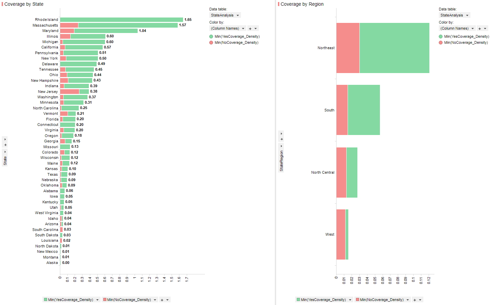

```{r setup, include=FALSE}
knitr::opts_chunk$set(echo = TRUE)
```

## Mental Health

The data included in this study is provided by 


```{r loadLibraries}
if (!require(plyr)) install.packages("plyr")
if (!require(DataExplorer)) install.packages("DataExplorer")
if (!require(sqldf)) install.packages("sqldf")
if (!require(Hmisc)) install.packages("Hmisc")
if (!require(tidyr)) install.packages("tidyr")
if (!require(dplyr)) install.packages("dplyr")
if (!require(car)) install.packages("car")
```

```{r renameColumns}
#Read in File
MHData <- read.csv("mental-heath-in-tech-2016_20161114.csv", header=TRUE, sep=",")

#Update Column Names
colnames(MHData)[colnames(MHData)=='Are.you.self.employed.'] <- 'SelfEmployed'
colnames(MHData)[colnames(MHData)=='How.many.employees.does.your.company.or.organization.have.'] <- 'CompanySize'
colnames(MHData)[colnames(MHData)=='Is.your.employer.primarily.a.tech.company.organization.'] <- 'TechCompany'
colnames(MHData)[colnames(MHData)=='Is.your.primary.role.within.your.company.related.to.tech.IT.'] <- 'RoleIT'
colnames(MHData)[colnames(MHData)=='Does.your.employer.provide.mental.health.benefits.as.part.of.healthcare.coverage.'] <- 'ProvideMHCoverage'
colnames(MHData)[colnames(MHData)=='Do.you.know.the.options.for.mental.health.care.available.under.your.employer.provided.coverage.'] <- 'AwareOfCoverage'
colnames(MHData)[colnames(MHData)=='Has.your.employer.ever.formally.discussed.mental.health..for.example..as.part.of.a.wellness.campaign.or.other.official.communication..'] <- 'CompanyDiscussMH'
colnames(MHData)[colnames(MHData)=='Does.your.employer.offer.resources.to.learn.more.about.mental.health.concerns.and.options.for.seeking.help.'] <- 'CompanyOfferResources'
colnames(MHData)[colnames(MHData)=='Is.your.anonymity.protected.if.you.choose.to.take.advantage.of.mental.health.or.substance.abuse.treatment.resources.provided.by.your.employer.'] <- 'AnonymityProtected'
colnames(MHData)[colnames(MHData)=='If.a.mental.health.issue.prompted.you.to.request.a.medical.leave.from.work..asking.for.that.leave.would.be.'] <- 'MHPromptedMedLeave'
colnames(MHData)[colnames(MHData)=='Do.you.think.that.discussing.a.mental.health.disorder.with.your.employer.would.have.negative.consequences.'] <- 'DiscussMHCompanyNegative'
colnames(MHData)[colnames(MHData)=='Do.you.think.that.discussing.a.physical.health.issue.with.your.employer.would.have.negative.consequences.'] <- 'DiscussPHCompanyNegative'
colnames(MHData)[colnames(MHData)=='Would.you.feel.comfortable.discussing.a.mental.health.disorder.with.your.coworkers.'] <- 'DiscussMHWithCoWorkers'
colnames(MHData)[colnames(MHData)=='Would.you.feel.comfortable.discussing.a.mental.health.disorder.with.your.direct.supervisor.s..'] <- 'DiscussMHWithBoss'
colnames(MHData)[colnames(MHData)=='Do.you.feel.that.your.employer.takes.mental.health.as.seriously.as.physical.health.'] <- 'CompanySeriousMHasPH'
colnames(MHData)[colnames(MHData)=='Have.you.heard.of.or.observed.negative.consequences.for.co.workers.who.have.been.open.about.mental.health.issues.in.your.workplace.'] <- 'ObsNegOpenWithMH'
colnames(MHData)[colnames(MHData)=='Do.you.have.medical.coverage..private.insurance.or.state.provided..which.includes.treatment.of.Â.mental.health.issues.'] <- 'MedicalCoverage'
colnames(MHData)[colnames(MHData)=='Do.you.know.local.or.online.resources.to.seek.help.for.a.mental.health.disorder.'] <- 'KnowMHResources'
colnames(MHData)[colnames(MHData)=='If.you.have.been.diagnosed.or.treated.for.a.mental.health.disorder..do.you.ever.reveal.this.to.clients.or.business.contacts.'] <- 'MHDisclosedToClients'
colnames(MHData)[colnames(MHData)=='If.you.have.revealed.a.mental.health.issue.to.a.client.or.business.contact..do.you.believe.this.has.impacted.you.negatively.'] <- 'MHDisclosedToClientsWithNegActions'
colnames(MHData)[colnames(MHData)=='If.you.have.been.diagnosed.or.treated.for.a.mental.health.disorder..do.you.ever.reveal.this.to.coworkers.or.employees.'] <- 'MHDisclosedToCoWorkers'
colnames(MHData)[colnames(MHData)=='If.you.have.revealed.a.mental.health.issue.to.a.coworker.or.employee..do.you.believe.this.has.impacted.you.negatively.'] <- 'MHDisclosedToCoWorkersWithNegActions'
colnames(MHData)[colnames(MHData)=='Do.you.believe.your.productivity.is.ever.affected.by.a.mental.health.issue.'] <- 'MHAffectProductivity'
colnames(MHData)[colnames(MHData)=='If.yes..what.percentage.of.your.work.time..time.performing.primary.or.secondary.job.functions..is.affected.by.a.mental.health.issue.'] <- 'PercWorkAffectedByMH'
colnames(MHData)[colnames(MHData)=='Do.you.have.previous.employers.'] <- 'PrevCo'
colnames(MHData)[colnames(MHData)=='Have.your.previous.employers.provided.mental.health.benefits.'] <- 'PrevCoProvideMH'
colnames(MHData)[colnames(MHData)=='Were.you.aware.of.the.options.for.mental.health.care.provided.by.your.previous.employers.'] <- 'PrevCoAwareMHCoverage'
colnames(MHData)[colnames(MHData)=='Did.your.previous.employers.ever.formally.discuss.mental.health..as.part.of.a.wellness.campaign.or.other.official.communication..'] <- 'PrevCoDiscussMH'
colnames(MHData)[colnames(MHData)=='Did.your.previous.employers.provide.resources.to.learn.more.about.mental.health.issues.and.how.to.seek.help.'] <- 'PrevCoOfferResources'
colnames(MHData)[colnames(MHData)=='Was.your.anonymity.protected.if.you.chose.to.take.advantage.of.mental.health.or.substance.abuse.treatment.resources.with.previous.employers.'] <- 'PrevCoAnonymityProtected'
colnames(MHData)[colnames(MHData)=='Do.you.think.that.discussing.a.mental.health.disorder.with.previous.employers.would.have.negative.consequences.'] <- 'PrevCoDiscussMHCompanyNegative'
colnames(MHData)[colnames(MHData)=='Do.you.think.that.discussing.a.physical.health.issue.with.previous.employers.would.have.negative.consequences.'] <- 'PrevCoDiscussPHCompanyNegative'
colnames(MHData)[colnames(MHData)=='Would.you.have.been.willing.to.discuss.a.mental.health.issue.with.your.previous.co.workers.'] <- 'PrevCoDiscussMHWithCoWorkers'
colnames(MHData)[colnames(MHData)=='Would.you.have.been.willing.to.discuss.a.mental.health.issue.with.your.direct.supervisor.s..'] <- 'PrevCoDiscussMHWithBoss'
colnames(MHData)[colnames(MHData)=='Did.you.feel.that.your.previous.employers.took.mental.health.as.seriously.as.physical.health.'] <- 'PrevCoCompanySeriousMHasPH'
colnames(MHData)[colnames(MHData)=='Did.you.hear.of.or.observe.negative.consequences.for.co.workers.with.mental.health.issues.in.your.previous.workplaces.'] <- 'PrevCoObsNegOpenWithMH'
colnames(MHData)[colnames(MHData)=='Would.you.be.willing.to.bring.up.a.physical.health.issue.with.a.potential.employer.in.an.interview.'] <- 'PotDiscussPH'
colnames(MHData)[colnames(MHData)=='Why.or.why.not.'] <- 'PotDiscussPH_Why'
colnames(MHData)[colnames(MHData)=='Would.you.bring.up.a.mental.health.issue.with.a.potential.employer.in.an.interview.'] <- 'PotDiscussMH'
colnames(MHData)[colnames(MHData)=='Why.or.why.not..1'] <- 'PotDiscussMH_Why'
colnames(MHData)[colnames(MHData)=='Do.you.feel.that.being.identified.as.a.person.with.a.mental.health.issue.would.hurt.your.career.'] <- 'MHHurtCareer'
colnames(MHData)[colnames(MHData)=='Do.you.think.that.team.members.co.workers.would.view.you.more.negatively.if.they.knew.you.suffered.from.a.mental.health.issue.'] <- 'CoWorkersViewYouNegKnewMH'
colnames(MHData)[colnames(MHData)=='How.willing.would.you.be.to.share.with.friends.and.family.that.you.have.a.mental.illness.'] <- 'DiscloseMHFamilyFriends'
colnames(MHData)[colnames(MHData)=='Have.you.observed.or.experienced.an.unsupportive.or.badly.handled.response.to.a.mental.health.issue.in.your.current.or.previous.workplace.'] <- 'NegResponseWithMH'
colnames(MHData)[colnames(MHData)=='Have.your.observations.of.how.another.individual.who.discussed.a.mental.health.disorder.made.you.less.likely.to.reveal.a.mental.health.issue.yourself.in.your.current.workplace.'] <- 'LessLikelyDiscloseMHPreviousEncounter'
colnames(MHData)[colnames(MHData)=='Do.you.have.a.family.history.of.mental.illness.'] <- 'FamilyHistoryMH'
colnames(MHData)[colnames(MHData)=='Have.you.had.a.mental.health.disorder.in.the.past.'] <- 'MHDisorderPast'
colnames(MHData)[colnames(MHData)=='Do.you.currently.have.a.mental.health.disorder.'] <- 'MHCurrently'
colnames(MHData)[colnames(MHData)=='If.yes..what.condition.s..have.you.been.diagnosed.with.'] <- 'MHCurrentlyDiagnosed'
colnames(MHData)[colnames(MHData)=='If.maybe..what.condition.s..do.you.believe.you.have.'] <- 'MHCurrentlyDiagnosedConditions'
colnames(MHData)[colnames(MHData)=='Have.you.been.diagnosed.with.a.mental.health.condition.by.a.medical.professional.'] <- 'MHDiagnosedByDoc'
colnames(MHData)[colnames(MHData)=='If.so..what.condition.s..were.you.diagnosed.with.'] <- 'MHDiagnosedByDoc_Diagnosis'
colnames(MHData)[colnames(MHData)=='Have.you.ever.sought.treatment.for.a.mental.health.issue.from.a.mental.health.professional.'] <- 'MHSoughtTreatment'
colnames(MHData)[colnames(MHData)=='If.you.have.a.mental.health.issue..do.you.feel.that.it.interferes.with.your.work.when.being.treated.effectively.'] <- 'MHInteferesWhenTreated'
colnames(MHData)[colnames(MHData)=='If.you.have.a.mental.health.issue..do.you.feel.that.it.interferes.with.your.work.when.NOT.being.treated.effectively.'] <- 'MHInteferesWhenNotTreated'
colnames(MHData)[colnames(MHData)=='What.is.your.age.'] <- 'Age'
colnames(MHData)[colnames(MHData)=='What.is.your.gender.'] <- 'Gender'
colnames(MHData)[colnames(MHData)=='What.country.do.you.live.in.'] <- 'Country'
colnames(MHData)[colnames(MHData)=='What.US.state.or.territory.do.you.live.in.'] <- 'State'
colnames(MHData)[colnames(MHData)=='What.country.do.you.work.in.'] <- 'CountryWorkIn'
colnames(MHData)[colnames(MHData)=='What.US.state.or.territory.do.you.work.in.'] <- 'StateWorkIn'
colnames(MHData)[colnames(MHData)=='Which.of.the.following.best.describes.your.work.position.'] <- 'CurrentPosition'
colnames(MHData)[colnames(MHData)=='Do.you.work.remotely.'] <- 'WorkRemotely'

#List Column names
colnames(MHData)
```

```{r plotMissingValues}
#Graphical representation of missing vaules using 'DataExporer' library
plot_missing(MHData, title = "Percent of Missing Values")

#Function to count all NA's in columns
propmiss <- function(dataframe) {
  m <- sapply(dataframe, function(x) {
    data.frame(
      na_count=sum(is.na(x)),
      Obs=length(x), 
      perc_missing=sum(is.na(x))/length(x)*100
    )
  })
  d <- data.frame(t(m))
  d <- sapply(d, unlist)
  d <- as.data.frame(d)
  d$variable <- row.names(d)
  row.names(d) <- NULL
  d <- cbind(d[ncol(d)],d[-ncol(d)])
  return(d[order(d$na_count, decreasing=TRUE), ])
}

#show results of NA's counted
propmiss(MHData)
```

```{r dataSetup}
#remove singlw quotes
MHData$ProvideMHCoverage <- gsub("\'","", MHData$ProvideMHCoverage)
MHData$AnonymityProtected <- gsub("\'","", MHData$AnonymityProtected)
MHData$MHHurtCareer <- gsub("\'","", MHData$MHHurtCareer)
MHData$CoWorkersViewYouNegKnewMH <- gsub("\'","", MHData$CoWorkersViewYouNegKnewMH)

MHSubset <- sqldf("SELECT 
                  SelfEmployed
                  ,ProvideMHCoverage
                  ,AnonymityProtected
                  ,DiscussMHCompanyNegative
                  ,DiscussPHCompanyNegative
                  ,DiscussMHWithBoss
                  ,ObsNegOpenWithMH
                  ,MedicalCoverage
                  ,PercWorkAffectedByMH
                  ,PrevCoAwareMHCoverage
                  ,MHHurtCareer
                  ,CoWorkersViewYouNegKnewMH
                  ,NegResponseWithMH
                  ,MHCurrently
                  ,MHCurrentlyDiagnosed
                  ,Age
                  ,Gender
                  ,State
                  ,CurrentPosition
                  ,WorkRemotely
                  
                  ,case
                  when WorkRemotely = 'Never' then 0
                  when WorkRemotely = 'Always' then 1
                  when WorkRemotely = 'Sometimes' then 2
                  else NULL
                  end as NUM_WorkRemotely
                  
                  ,case 
                  when ProvideMHCoverage = 'Not eligible for coverage / N/A' then 0
                  when ProvideMHCoverage = 'No' then 0
                  when ProvideMHCoverage = 'Yes' then 1
                  when ProvideMHCoverage = 'I dont know' then 2
                  else NULL 
                  end as NUM_ProvideMHCoverage
                  
                  ,case 
                  when AnonymityProtected = 'No' then 0
                  when AnonymityProtected = 'Yes' then 1
                  when AnonymityProtected = 'I dont know' then 2
                  else NULL 
                  end as NUM_AnonymityProtected
                  
                  ,case 
                  when DiscussMHCompanyNegative = 'No' then 0
                  when DiscussMHCompanyNegative = 'Yes' then 1
                  when DiscussMHCompanyNegative = 'Maybe' then 2
                  else NULL 
                  end as NUM_DiscussMHCompanyNegative
                  
                  ,case 
                  when DiscussPHCompanyNegative = 'No' then 0
                  when DiscussPHCompanyNegative = 'Yes' then 1
                  when DiscussPHCompanyNegative = 'Maybe' then 2
                  else NULL 
                  end as NUM_DiscussPHCompanyNegative
                  
                  ,case 
                  when DiscussMHWithBoss = 'No' then 0
                  when DiscussMHWithBoss = 'Yes' then 1
                  when DiscussMHWithBoss = 'Maybe' then 2
                  else NULL 
                  end as NUM_DiscussMHWithBoss
                  
                  ,case 
                  when ObsNegOpenWithMH = 'No' then 0
                  when ObsNegOpenWithMH = 'Yes' then 1
                  else NULL 
                  end as NUM_ObsNegOpenWithMH

                  ,case 
                  when MedicalCoverage = 0 then 0
                  when MedicalCoverage = 1 then 1
                  when MedicalCoverage = 'NA' then NULL
                  when MedicalCoverage is NULL then NULL
                  end as NUM_MedicalCoverage
                  
                  ,case 
                  when PercWorkAffectedByMH = '1-25%' then 'Low'
                  when PercWorkAffectedByMH = '26-50%' then 'Low_to_Medium'
                  when PercWorkAffectedByMH = '51-75%' then 'Medium'
                  when PercWorkAffectedByMH = '76-100%' then 'High'
                  else NULL 
                  end as CAT_PercWorkAffectedByMH
                  
                  ,case 
                  when MHHurtCareer = 'Maybe' then 2
                  when MHHurtCareer = 'No, I dont think it would' then 0
                  when MHHurtCareer = 'No, it has not' then 0
                  when MHHurtCareer = 'Yes, ' then 1
                  when MHHurtCareer = 'Yes, I think it would' then 1
                  when MHHurtCareer = 'Yes, it has' then 1
                  else NULL 
                  end as CAT_MHHurtCareer
                  
                  ,case 
                  when CoWorkersViewYouNegKnewMH = 'Maybe' then 2
                  when CoWorkersViewYouNegKnewMH = 'No, I dont think they would' then 0
                  when CoWorkersViewYouNegKnewMH = 'No, they do not' then 0
                  when CoWorkersViewYouNegKnewMH = 'Yes, ' then 1
                  when CoWorkersViewYouNegKnewMH = 'Yes, I think they would' then 1
                  when CoWorkersViewYouNegKnewMH = 'Yes, they do' then 1
                  else NULL 
                  end as NUM_CoWorkersViewYouNegKnewMH

,case
when NegResponseWithMH = 'No' then 0
when NegResponseWithMH = 'Maybe/Not sure' then 2
when NegResponseWithMH = 'Yes, I experienced' then 1
when NegResponseWithMH = 'Yes, I observed' then 1
when NegResponseWithMH = 'N/A' then NULL
when NegResponseWithMH is NULL then NULL
else NULL end as NUM_NegResponseWithMH
                  
                  ,case 
                  when MHCurrently = 'Maybe' then 2
                  when MHCurrently = 'No' then 0
                  when MHCurrently = 'Yes' then 1
                  else NULL 
                  end as NUM_MHCurrently
                  
                  ,case 
                  when MHCurrentlyDiagnosed like 'Addictive Disorder' then 'Addiction'
                  when MHCurrentlyDiagnosed like 'Anxiety' then 'Anxiety'
                  when MHCurrentlyDiagnosed like 'Attention Def' then 'Attention'
                  when MHCurrentlyDiagnosed like 'Autism' then 'Autism'
                  when MHCurrentlyDiagnosed like 'Burn' then 'Burnout'
                  when MHCurrentlyDiagnosed like 'Combination of physical' then 'Attention'
                  when MHCurrentlyDiagnosed like 'Depression' then 'Depression'
                  when MHCurrentlyDiagnosed like 'Eating Disorder' then 'Eating'
                  when MHCurrentlyDiagnosed like 'I haven' then 'Unknown'
                  when MHCurrentlyDiagnosed like 'Mood Disorder' then 'Mood'
                  when MHCurrentlyDiagnosed like 'Obsessive-Compulsive Disorder' then 'Obsessive-Compulsive'
                  when MHCurrentlyDiagnosed like 'PDD-NOS' then 'PDD-NOS'
                  when MHCurrentlyDiagnosed like 'Personality Disorder' then 'Personality'
                  when MHCurrentlyDiagnosed like 'Post-traumatic Stress Disorder' then 'PTSD'
                  when MHCurrentlyDiagnosed like 'Schizotypal Personality Disorder' then 'Schizotypal'
                  when MHCurrentlyDiagnosed like 'Seasonal Affective Disorder' then 'Seasonal_Affective'
                  when MHCurrentlyDiagnosed like 'Sexual addiction' then 'Sexual_Addiction'
                  when MHCurrentlyDiagnosed like 'Stress Response Syndromes' then 'Stress_Response'
                  when MHCurrentlyDiagnosed like 'Transgender' then 'Transgender/Mood/Anxiety'
                  when MHCurrentlyDiagnosed like 'Traumatic Brain Injury' then 'Traumatic_Brain_Injury'
                  else NULL 
                  end as CAT_MHCurrentlyDiagnosed
                  
                  ,case
                  when CurrentPosition = 'Designer' then 'Designer'
                  when CurrentPosition = 'Support|Designer' then 'Designer'
                  when CurrentPosition = 'Support|Designer|Front-end Developer' then 'Designer'
                  when CurrentPosition = 'Back-end Developer' then 'Developer'
                  when CurrentPosition = 'Other|Back-end Developer' then 'Developer'
                  when CurrentPosition = 'Support|Back-end Developer' then 'Developer'
                  when CurrentPosition = 'Support|Front-end Developer|Back-end Developer' then 'Developer'
                  when CurrentPosition = 'Front-end Developer' then 'Developer'
                  when CurrentPosition = 'Other|Designer|Front-end Developer' then 'Developer'
                  when CurrentPosition = 'Other|Front-end Developer' then 'Developer'
                  when CurrentPosition = 'Dev Evangelist/Advocate' then 'DevEvangelist'
                  when CurrentPosition = 'Other|Dev Evangelist/Advocate' then 'DevEvangelist'
                  when CurrentPosition = 'DevOps/SysAdmin' then 'DevOps'
                  when CurrentPosition = 'Other|DevOps/SysAdmin|Back-end Developer' then 'DevOps'
                  when CurrentPosition = 'Support|DevOps/SysAdmin' then 'DevOps'
                  when CurrentPosition = 'Executive Leadership' then 'Exec_Leadership'
                  when CurrentPosition = 'Other|Executive Leadership' then 'Exec_Leadership'
                  when CurrentPosition = 'HR' then 'HR'
                  when CurrentPosition = 'Other|HR' then 'HR'
                  when CurrentPosition = 'One-person shop' then 'OnePerson'
                  when CurrentPosition = 'Other|Front-end Developer|Designer|One-person shop' then 'OnePerson'
                  when CurrentPosition = 'Other|One-person shop' then 'OnePerson'
                  when CurrentPosition = 'Sales|Support|DevOps/SysAdmin|Executive Leadership' then 'OnePerson'
                  when CurrentPosition = 'Support|Sales|Back-end Developer|Front-end Developer|Designer|One-person shop' then 'OnePerson'
                  when CurrentPosition = 'Other' then 'Other'
                  when CurrentPosition = 'Support|Other' then 'Other'
                  when CurrentPosition = 'Sales' then 'Sales'
                  when CurrentPosition = 'Other|Supervisor/Team Lead' then 'Supervisor'
                  when CurrentPosition = 'Supervisor/Team Lead' then 'Supervisor'
                  when CurrentPosition = 'Support|HR|Supervisor/Team Lead|Executive Leadership' then 'Supervisor'
                  when CurrentPosition = 'Other|Support' then 'Support'
                  when CurrentPosition = 'Support' then 'Support'
                  end as CAT_CurrentPosition
                  ,case
                    WHEN MHCurrentlyDiagnosed LIKE '%Substance Use%' then 1
                    else 0
                  end AS HasSubstanceAbuse
                  FROM MHData")

#Subset of data for analysis
MHSubsetAnalysis <- sqldf("SELECT
                              SelfEmployed
                              ,NUM_ProvideMHCoverage
                              ,NUM_AnonymityProtected
                              ,NUM_DiscussMHCompanyNegative
                              ,NUM_DiscussPHCompanyNegative
                              ,NUM_DiscussMHWithBoss
                              ,NUM_ObsNegOpenWithMH
                              ,NUM_MedicalCoverage
                              ,CAT_PercWorkAffectedByMH
                              ,CAT_MHHurtCareer
                              ,NUM_CoWorkersViewYouNegKnewMH
                              ,NUM_NegResponseWithMH
                              ,NUM_MHCurrently
                              ,CAT_MHCurrentlyDiagnosed
                              ,Age
                              ,State
                              ,CAT_CurrentPosition
                              ,WorkRemotely
                              ,NUM_WorkRemotely
                              ,MHCurrentlyDiagnosed
                              ,HasSubstanceAbuse
                      FROM MHSubset")

#colnames(MHSubset)
```

```{r utilityFunctions}
#Create a function that will massage our data into a consumable format.
explodeDataFrameColumn <- function(dataframe, columnName){
  columnIndex <- which(names(dataframe) == columnName)
  #remove rows with blank values
  dataframe <- dataframe[!(is.na(dataframe[,columnIndex]) | dataframe[,columnIndex] == ""),]

  #Split pipe delimitted values into rows.
  returnValue <- separate_rows(dataframe, columnName, sep = "\\|")
}
```

## Job Analysis

1. Do certain technology job roles line up with specific mental health diagnoses?

Our team was interested in determining if there is a correlation between mental health diagnoses and technology job roles. For exammple, is there a higher prevelance of anxiety disorder attributed to back-end developers? If we can find a correlation, perhaps we can better target treatment based on a person's job role.

By analyzing the data, we do not find any significant correlation between job role and mental health diagnoses. We will need to determine other avenues for targeting treatment.

```{r jobRoleAnalysis}
#Create a subset data frame to hold diagnoses and job role data.
MHPosition <- data.frame(CurrentDiagnoses = MHSubset$MHCurrentlyDiagnosed, CurrentPosition = MHSubset$CurrentPosition)

#break up the pipe delimitted values into rows.
MHPositionSplit <- explodeDataFrameColumn(MHPosition, "CurrentDiagnoses")
MHPositionSplit <- explodeDataFrameColumn(MHPositionSplit, "CurrentPosition")

#create lookup tables so we can run correlation analysis
diagnoses <- data.frame(Diagnosis = unique(MHPositionSplit$CurrentDiagnoses), DiagnosisCode = 1:length(unique(MHPositionSplit$CurrentDiagnoses)))
positions <- data.frame(Position = unique(MHPositionSplit$CurrentPosition), PositionCode = 1:length(unique(MHPositionSplit$CurrentPosition)))

#rename columns so we can use merge function.
colnames(MHPositionSplit) <- c("Diagnosis", "Position")

MHPositionSplitCoded <- merge(MHPositionSplit, diagnoses, by = "Diagnosis")
MHPositionSplitCoded <- merge(MHPositionSplitCoded, positions, by = "Position")
plot(MHPositionSplitCoded$DiagnosisCode, MHPositionSplitCoded$PositionCode)
#correlation value
cor(MHPositionSplitCoded$DiagnosisCode, MHPositionSplitCoded$PositionCode)
```
<!-- 2. Is there a correlation between remote work and mental health diagnosis? -->

<!-- ```{r remoteWorkAnalysis} -->
<!-- RemoteWorkAnalysis <- data.frame(WorkRemotely = MHSubsetAnalysis$NUM_WorkRemotely, CurrentlyDiagnosed = MHSubsetAnalysis$NUM_MHCurrently) -->
<!-- RemoteWorkAnalysis <- RemoteWorkAnalysis[!(RemoteWorkAnalysis$WorkRemotely == 2 | RemoteWorkAnalysis$CurrentlyDiagnosed == 2),] -->
<!-- plot(RemoteWorkAnalysis$WorkRemotely, RemoteWorkAnalysis$CurrentlyDiagnosed) -->
<!-- cor(RemoteWorkAnalysis$WorkRemotely, RemoteWorkAnalysis$CurrentlyDiagnosed) -->
<!-- ``` -->

## State Analysis

1.   Is mental healthcare coverage higher in certain states?

The team subsetted the data to only rows that had state names and for rows that had identified if the company provided mental health coverage.  From this inital exclusion of data the data was subsetted from 1,433 rows of data to 515 rows of data which constituents 36% of useable data.

From the limited data set we can see that most companies offer mental health insurance, when normalizing the data to the per 1000 square miles of each state we see that Rhode Island, Massachusetts, and Maryland have thie highest coverage of mental health insurance.  This coincides when charting the coverage by region, which shows Northeast part of the US having the highest coverage.

Though the analysis shows the Northeast having the most insured individuals with mental health coverage, the results should be used cautiously as the bulk of the observations are unuseable due to a lack of response.

*District of Columbia was removed as it is not a state*

*Graphic provided by Spotfire application*


```{r StateAnalysis}
##############################
###
###   Data Frame of NO coverage
###
##############################
#ProvideMHCoverage 0 = No
#ProvideMHCoverage 1 = yes
MHSubset_StateAnalysisNOs <- sqldf("Select 
                                State
                                ,NUM_ProvideMHCoverage
                                FROM MHSubsetAnalysis
                                WHERE State <> ''
                                AND NUM_ProvideMHCoverage = 0")

#count of medical centers by state
MHSubset_StateAnalysisNOs <- sqldf("select State 
                                  ,count(*) as CountOfNoCoverage
                                  from MHSubsetAnalysis
                                  WHERE State <> ''
                                  AND NUM_ProvideMHCoverage = 0
                                  group by State
                                  Order by 2 desc")

#Add sum column
MHSubset_StateAnalysisNOs$sum <- ave(MHSubset_StateAnalysisNOs$CountOfNoCoverage, FUN=sum)
colnames(MHSubset_StateAnalysisNOs)[colnames(MHSubset_StateAnalysisNOs)=='sum'] <- 'TotalNoCoverage'

##############################
###
###   Data Frame of Yes coverage
###
##############################
MHSubset_StateAnalysisYES <- sqldf("Select 
                                State
                                   ,NUM_ProvideMHCoverage
                                   FROM MHSubsetAnalysis
                                   WHERE State <> ''
                                   AND NUM_ProvideMHCoverage = 1")

#count of medical centers by state
MHSubset_StateAnalysisYES <- sqldf("select State 
                                   ,count(*) as CountOfYesCoverage
                                   from MHSubsetAnalysis
                                   WHERE State <> ''
                                   AND NUM_ProvideMHCoverage = 1
                                   group by State
                                   Order by 2 desc")

#Add sum column
MHSubset_StateAnalysisYES$sum <- ave(MHSubset_StateAnalysisYES$CountOfYesCoverage, FUN=sum)
colnames(MHSubset_StateAnalysisYES)[colnames(MHSubset_StateAnalysisYES)=='sum'] <- 'TotalYesCoverage'

#################################
#####                          
#####    Make State DB         
#####                          
#################################

#Create State DB data frame
StateDB <- data.frame(state.name, state.area, state.region)
colnames(StateDB)[colnames(StateDB)=='state.name'] <- 'State'
colnames(StateDB)[colnames(StateDB)=='state.area'] <- 'StateSize_mi2' #Data is in Square miles
colnames(StateDB)[colnames(StateDB)=='state.region'] <- 'StateRegion'

#Add district of Columbia to StateDB Data Frame
DistrictColumbia <- data.frame("District of Columbia", "68.34", "South")
names(DistrictColumbia) <- c("State", "StateSize_mi2", "StateRegion")
StateDB <- rbind(StateDB, DistrictColumbia)

##############################
###
###   Merge yes and no data frames
###       Merge StateDB
###
##############################

#Merge Yes and No data frames
StateAnalysis <- join(MHSubset_StateAnalysisYES, MHSubset_StateAnalysisNOs, by="State", type="full")

#Merge StateDB
StateAnalysis <- join(StateAnalysis, StateDB, by="State", type="inner")

#######################################################
####
####   Calculate new variable Yes/No coverage density
####
#######################################################

#Create density calculations
StateAnalysis <- sqldf("SELECT *
                             ,CountOfYesCoverage/(StateSize_mi2/1000.0) as YesCoverage_Density
                             ,CountOfNoCoverage/(StateSize_mi2/1000.0) as NoCoverage_Density
                             FROM StateAnalysis")

#Remove district of columbia -- outlier
StateAnalysis <- StateAnalysis[!(StateAnalysis$State=="District of Columbia"),]

```


## Remote Working Analysis

1.   Are there higher reports of mental health issues for remote workers?

The team subsetted the data to include the columns of 'WorkRemotely' and 'NUM_MHCurrently'.  These two columns are used to indicate if the observation has a mental health issue or not.  The team provided multiple ways to cross check the results to ensure that the results were verified.

A table is produced that aggregates the groups by the categorical variable 'WorkRemotely'
    a.   Always
    b.   Never
    c.   Sometimes

The binary responses of 'NUM_MHCurrently' are:
    a.   No = 0
    b.   Yes = 1

A proportion table is provided that shows the percentages of recieving a mental health issue by category.  From first look it seems that there is no significant chance of recieving a mental health issue from any of the categorical variables.  To test and confirm this hyptohesis the team decided to do a chi square test, a regression test, and a simple ANOVA test.  For each of these the test the Pvalue is greater than alpha of 0.05 indicating that there is no significant chance of recieving a mental health issue from working working at home, working at the office and at home, or working in the office full time.

From the data set provided the team concluded that there is no significant chance of being diagonsed with a mental health issue from individuals that work at the office, home, or both.

```{r RemoteAnalysis}
##############################
###
###     Location Demographics
###   MH Issues workers who work remotely
###
##############################

#Are there higher reports of mental health issues for remote workers?
#No = 0
#Yes = 1

MHRemotely <- sqldf("SELECT 
                    NUM_MHCurrently
                    ,WorkRemotely
                    FROM MHSubsetAnalysis
                    WHERE NUM_MHCurrently <> 2")

#Number obs in each category
table(MHRemotely$WorkRemotely, MHRemotely$NUM_MHCurrently)

#Proportion of recieveing MH issue
prop.table(table(MHRemotely$WorkRemotely, MHRemotely$NUM_MHCurrently), margin = 1)*100

#Chi square test of association
chisq.test(table(MHRemotely$WorkRemotely, MHRemotely$NUM_MHCurrently))

fitRW <- glm(NUM_MHCurrently ~ WorkRemotely, data=MHRemotely, family = binomial )
summary(fitRW)

```

## Substance Abuse Analysis

1. Do workes with substance abuse disorder feel more or less willing to discuss their issue with their supervisor when compared to other disorders?

The team subsetted the data to include the columns of 'HasSubstanceAbuse' and 'NUM_DiscussMHWithBoss'.  The NUM_DiscussMHWithBoss column is used to indicate if the observation is willing to discuss their mental health issue with their direct supervisor. The HasSubstanceAbuse column indicates if the observation's mental health issue relates to substance abuse.  The team provided multiple ways to cross check the results to ensure that the results were verified.

A table is produced that aggregates the groups by the binary variable 'HasSubstanceAbuse'

The binary responses of 'NUM_DiscussMHWithBoss' are:

No = 0

Yes = 1

A proportion table is provided that shows the percentages of workers with mental health issues that would discuss the issue with their direct supervisor. It appears that workers with a substance abuse disorder are more likely to discuss the situation with their boss when compared to workers with other mental health issues. 59.1% of workers with a substance abuse problem would discuss the issue with their supervisor compared to 53.8% of workers with other mental health issues. 

```{r substanceAbuseSupervisor}
#Get a subset of workers with mental health issues for analysis
MHSubstanceAbuseSupervisor <- sqldf("SELECT 
                    NUM_DiscussMHWithBoss
                    ,HasSubstanceAbuse
                    FROM MHSubsetAnalysis
                    WHERE NUM_DiscussMHWithBoss <> 2
                    AND NUM_MHCurrently=1")

#Number obs in each category
table(HasSubstanceAbuse=MHSubstanceAbuseSupervisor$HasSubstanceAbuse, DiscussWithBoss=MHSubstanceAbuseSupervisor$NUM_DiscussMHWithBoss)

#Proportion of those with substance abuset that would discuss the issue with their supervisor
prop.table(table(HasSubstanceAbuse=MHSubstanceAbuseSupervisor$HasSubstanceAbuse, DiscussWithBoss=MHSubstanceAbuseSupervisor$NUM_DiscussMHWithBoss), margin = 1)*100

#Chi square test of association
chisq.test(table(HasSubstanceAbuse=MHSubstanceAbuseSupervisor$HasSubstanceAbuse, DiscussWithBoss=MHSubstanceAbuseSupervisor$NUM_DiscussMHWithBoss))

fitSA <- glm(NUM_DiscussMHWithBoss ~ HasSubstanceAbuse, data=MHSubstanceAbuseSupervisor, family = binomial )
summary(fitSA)
```


2. Do workers with substance abuse disorders report that their anonymity was more or less protected when compmared to other mental health issues?

The team subsetted the data to include the columns of 'HasSubstanceAbuse' and 'NUM_AnonymityProtected'.  The NUM_AnonymityProtected column is used to indicate if the observation reports their anonymity was protected after divulging their mental health issue. The HasSubstanceAbuse column indicates if the observation's mental health issue relates to substance abuse.  The team provided multiple ways to cross check the results to ensure that the results were verified.

A table is produced that aggregates the groups by the binary variable 'HasSubstanceAbuse'

The binary responses of 'NUM_AnonymityProtected' are:

No = 0

Yes = 1

A proportion table is provided that shows the percentages of workers with mental health issues that believe their anonymity was protected after divulging a mental health issue. It appears that workers with a substance abuse disorder are less likely to report their anonymity was protected when compared to other mental health issues. 72.22% of workers with substance abuse disorder report their anonymity was protected compared to 83.97% of workers with other mental health issues. It is encouraging to see that workers with both substance abuse disorders and other mental health issues report a high degree of anonymity.

```{r substanceAbuseAnonymity}
#Get a subset of workers with mental health issues for analysis
MHSubstanceAbuseAnonymity <- sqldf("SELECT 
                    NUM_AnonymityProtected
                    ,HasSubstanceAbuse
                    FROM MHSubsetAnalysis
                    WHERE NUM_AnonymityProtected <> 2
                    AND NUM_MHCurrently=1")

#Number obs in each category
table(HasSubstanceAbuse=MHSubstanceAbuseAnonymity$HasSubstanceAbuse, AnonymityProtected=MHSubstanceAbuseAnonymity$NUM_AnonymityProtected)

#Proportion of those with substance abuset that would discuss the issue with their supervisor
prop.table(table(HasSubstanceAbuse=MHSubstanceAbuseAnonymity$HasSubstanceAbuse, AnonymityProtected=MHSubstanceAbuseAnonymity$NUM_AnonymityProtected), margin = 1)*100

#Chi square test of association
chisq.test(table(HasSubstanceAbuse=MHSubstanceAbuseAnonymity$HasSubstanceAbuse, AnonymityProtected=MHSubstanceAbuseAnonymity$NUM_AnonymityProtected))

fitSAA <- glm(NUM_AnonymityProtected ~ HasSubstanceAbuse, data=MHSubstanceAbuseAnonymity, family = binomial )
summary(fitSAA)
```

3. Do workers with substance abuse disorder report that they have experience with unsuportive response when compared to other mental health issues?

The team subsetted the data to include the columns of 'HasSubstanceAbuse' and 'NUM_NegResponseWithMH'.  The NUM_NegResponseWithMH column is used to indicate if the observation reports observing or experiencing an unsuportive repsonse with mental health issues in the workplace. The HasSubstanceAbuse column indicates if the observation's mental health issue relates to substance abuse.  The team provided multiple ways to cross check the results to ensure that the results were verified.

A table is produced that aggregates the groups by the binary variable 'HasSubstanceAbuse'

The binary responses of 'NUM_NegResponseWithMH' are:

No = 0

Yes = 1

A proportion table is provided that shows the percentages of workers with mental health issues that report observing or experiencing an unsuportive response to a mental health issue. It appears that workers with a substance abuse disorder are more likely to observe or experience an unsuportive reponse when compared to other mental health issues. 71.43% of workers with substance abuse disorder report an unsuportive response compared to 54.99% of workers with other mental health issues. It is disturbing to see such a high report of unsuportive responses for workers with substance abuse disorders.

```{r substanceAbuseNegResponse}
#Get a subset of workers with mental health issues for analysis
MHSubstanceAbuseNegResponse <- sqldf("SELECT 
                    NUM_NegResponseWithMH
                    ,HasSubstanceAbuse
                    FROM MHSubsetAnalysis
                    WHERE NUM_NegResponseWithMH <> 2
                    AND NUM_MHCurrently=1")

#Number obs in each category
table(HasSubstanceAbuse=MHSubstanceAbuseNegResponse$HasSubstanceAbuse, NegResponse=MHSubstanceAbuseNegResponse$NUM_NegResponseWithMH)

#Proportion of those with substance abuset that would discuss the issue with their supervisor
prop.table(table(HasSubstanceAbuse=MHSubstanceAbuseNegResponse$HasSubstanceAbuse, NegResponse=MHSubstanceAbuseNegResponse$NUM_NegResponseWithMH), margin = 1)*100

#Chi square test of association
chisq.test(table(HasSubstanceAbuse=MHSubstanceAbuseNegResponse$HasSubstanceAbuse, NegResponse=MHSubstanceAbuseNegResponse$NUM_NegResponseWithMH))

fitSAR <- glm(NUM_NegResponseWithMH ~ HasSubstanceAbuse, data=MHSubstanceAbuseNegResponse, family = binomial )
summary(fitSAR)
```

4. Do workers with substance abuse disorder report that they hear of negative consequences for co-workers with mental health issues?

